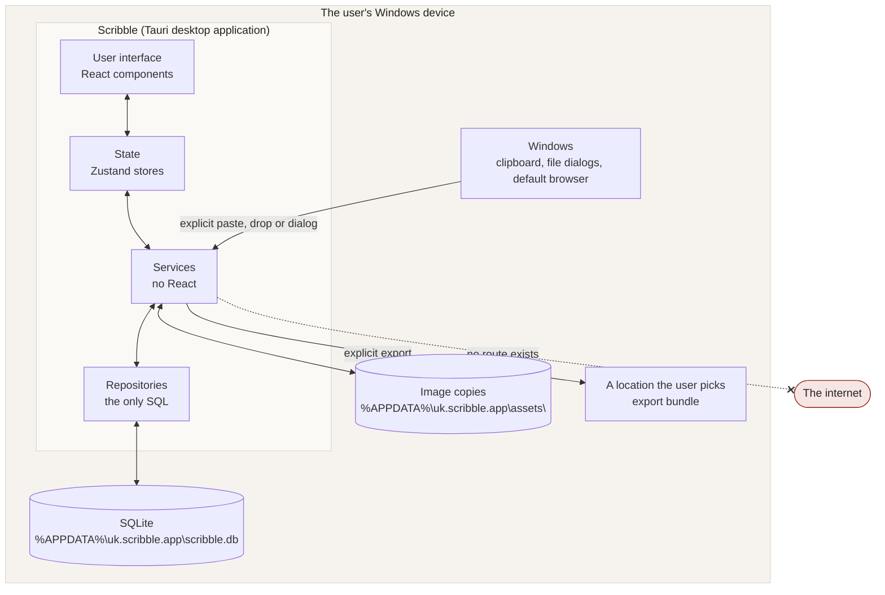
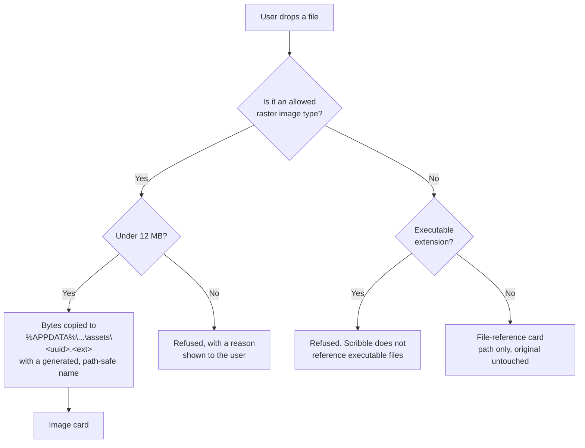
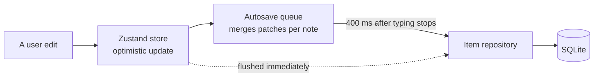

# Data flow — Scribble

**Version:** 0.1.0

This document describes every route by which data enters, moves through and leaves Scribble. If a route is not listed here, it does not exist in the code.

---

## 1. The overall picture

There is no arrow from Scribble to the internet, because there is no code that could draw one.

---

## 2. Data entering Scribble

Every inbound route requires a deliberate user action. Scribble never observes, polls or listens in the background.

| # | Route | Triggered by | Validation applied | Result |
|---|---|---|---|---|
| 1 | Typing a note | Double-click, `N`, or the toolbar | HTML sanitised through an allowlist on every keystroke and on blur | Note row |
| 2 | Checklist entry | `C` or the toolbar | Length limits per entry | Checklist row |
| 3 | Pen input | Pointer down on the deskpad with the pen tool active | Points clamped; pressure clamped to 0–1 | Vector stroke row |
| 4 | Paste | The user presses `Ctrl + V` while the deskpad has focus | Same rules as a drop; HTML sanitised | Note, link, or image card |
| 5 | Drag and drop | The user drops something on the deskpad | Type and size checks; executable extensions refused; SVG refused | Note, link, image, or file-reference card |
| 6 | Add a file reference | The toolbar opens the operating system's file dialog | Executable extensions refused; size checked | File-reference card storing a path only |
| 7 | Import a bundle | Settings → Import, then the operating system's file dialog | Zip parsed, JSON schema validated with Zod, identifiers regenerated, images re-stored under fresh local paths | New pads |
| 8 | Dictation | Explicit start, then explicit stop, and only if enabled in Settings | Transcript treated as plain text | Note row |

### What happens to a dropped file

Scribble never opens, runs, parses or previews a referenced file. "Show in folder" asks Windows to reveal the file in File Explorer; it does not launch it.

---

## 3. Data moving inside Scribble

The queue is also flushed when the pad changes, when the window loses focus, when the window is hidden, and before the page unloads, so a hidden or closed window cannot lose an edit.

The user interface never issues SQL. It calls repository interfaces (`PadRepository`, `ItemRepository`, `InkRepository`, `SettingsRepository`). Those interfaces are the boundary at which encryption could later be introduced without changing a single component.

---

## 4. Data leaving Scribble

There are exactly three ways data can leave, and all three are initiated by the user.

| # | Route | What leaves | Where it goes |
|---|---|---|---|
| 1 | Export | A `.zip` containing JSON, Markdown and image copies | A folder the user chooses in the operating system's save dialog |
| 2 | Opening a link | The URL only | The user's default browser, via the operating system |
| 3 | Showing a file in its folder | The path only | File Explorer, via the operating system |

Nothing else leaves. There is no automatic backup, no crash reporter, no update check and no usage reporting.

### What the ambient clock does not do

The date and time in the top bar are context for the person at the desk. They are deliberately excluded from every export, and `showDateInExports` is a setting that is hard-coded to `false` and cannot be changed.

---

## 5. Network boundary

Scribble makes no network requests. Four independent controls back that up:

1. **No client.** There is no HTTP client, no WebSocket client and no analytics SDK in the dependency tree used at runtime.
2. **Lint.** `no-restricted-globals` and `no-restricted-properties` rules make `fetch` and `XMLHttpRequest` a build failure.
3. **Content Security Policy.** `connect-src` is limited to `'self'` and the Tauri IPC channel; `default-src 'self'`; `frame-src 'none'`; `object-src 'none'`.
4. **Test.** A Playwright test records every request the page makes during a normal session and asserts that none is external.

The WebAssembly SQLite used by the browser development build is bundled locally by Vite. It is not fetched from a content delivery network, and it is not present in the packaged desktop application at all.

---

## 6. Tauri permission surface

The Rust shell exposes two commands, `toggle_deskpad` and `hide_deskpad`, neither of which takes user data. Everything else goes through official plugins restricted by `src-tauri/capabilities/default.json`:

| Plugin | What is allowed | What is not |
|---|---|---|
| `sql` | Load, execute, select and close, against `sqlite:scribble.db` | Any other database |
| `fs` | Read, write, create, remove and stat inside `$APPDATA/assets` | Anywhere else on the disk |
| `dialog` | Open and save dialogs | Nothing else |
| `opener` | Open a URL, reveal an item in its folder | Executing anything |
| `global-shortcut` | Register and unregister the summon shortcut | Nothing else |

There is no shell plugin, no HTTP plugin and no process plugin. Arbitrary command execution is not possible.
