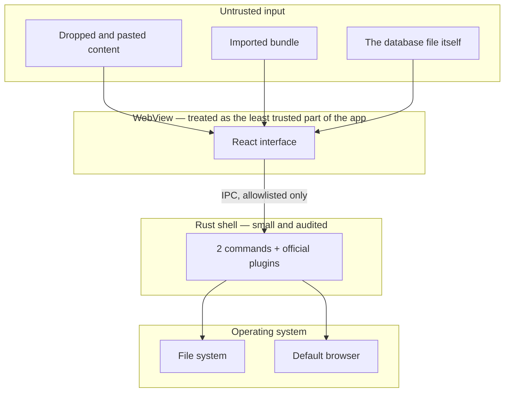

# Threat model — Scribble

**Version:** 0.1.0
**Method:** asset-led, with STRIDE used as a prompt list
**Status:** first pass for an early prototype. This is a working document, not a completed security assessment.

---

## 1. What we are protecting

| Asset | Why it matters | Sensitivity |
|---|---|---|
| Note content | Names, phone numbers, meeting comments, incident details, commercial fragments | **High** |
| Pen strokes | Same as note content, sometimes including sketched diagrams of systems | **High** |
| Image copies | Screenshots often contain more than the user remembers | **High** |
| File paths on reference cards | Reveal project names and folder structures | Medium |
| Preferences | Low value alone | Low |
| The user's wider machine | Scribble must not become a route to compromise it | **High** |

## 2. Who we are protecting against

| # | Actor | Capability | In scope |
|---|---|---|---|
| A1 | Someone walking past the desk | Can see the screen | Yes |
| A2 | Someone with brief physical access to an unlocked machine | Can read files, open applications | Yes |
| A3 | Someone with the powered-off laptop | Can attempt disk access | Partly |
| A4 | Malicious content the user drops or pastes | Arbitrary bytes, arbitrary markup, arbitrary file names | Yes |
| A5 | A malicious or compromised npm/crates dependency | Runs at build or run time | Partly |
| A6 | A remote network attacker | Can reach the machine over the network | Yes — trivially, as Scribble has no listener and no client |
| A7 | Another local user account on the same machine | Standard user privileges | Partly |
| A8 | An administrator or malware already running as the user | Full control | **No** — out of scope |

## 3. Trust boundaries

Three deliberate assumptions:

1. **The WebView is the least trusted component.** It is where untrusted content is handled, so its permissions are minimised and its Content Security Policy is strict.
2. **The database file is untrusted input.** It can be hand-edited or restored from an old export, so every row is validated on read rather than cast.
3. **The Rust shell is small on purpose.** Two commands, both of which take no user data.

---

## 4. Threats and controls

### T1 — Script injection through note content (STRIDE: Tampering, Elevation)

*A user pastes markup containing a script, or an imported bundle contains one. It executes inside the WebView, which can reach the IPC bridge.*

**Controls**

- All HTML passes through an allowlist sanitiser (`src/services/security/sanitise.ts`) before it is stored **and** before it is rendered. Tags outside the allowlist are dropped; every attribute except a validated `href` and `title` is removed.
- Link schemes are restricted to `http`, `https` and `mailto`. Control characters are rejected, so `java\0script:` cannot slip through.
- `dangerouslySetInnerHTML` is banned by an ESLint rule. Content reaches the DOM through a single ref-based assignment after sanitisation.
- Paste inside the editor is intercepted; the browser never inserts raw clipboard HTML.
- Content Security Policy: `script-src 'self'`, `object-src 'none'`, `frame-src 'none'`, `base-uri 'none'`.
- `freezePrototype` is enabled in the Tauri configuration.

**Residual risk:** Low. The sanitiser is hand-written and therefore the single most security-critical file in the project. It has direct unit tests covering scripts, event handlers, `javascript:`, `data:`, obfuscation and idempotency, and it should be re-reviewed whenever the allowlist changes.

---

### T2 — Path traversal into or out of the assets folder (STRIDE: Tampering)

*A dropped file, or an imported bundle, carries a name such as `..\..\Windows\System32\payload`.*

**Controls**

- Scribble never uses a supplied file name for storage. Copied images are written as `assets/<uuid>.<ext>`, where the extension is chosen from a fixed table keyed by MIME type.
- `safeAssetFileName` strips directory separators, traversal sequences, control characters, Windows-invalid characters and reserved device names, and is used for names inside export bundles.
- `isSafeRelativePath` rejects absolute paths, drive letters, backslashes and `..` segments, and guards every read of a stored asset.
- The Tauri capability grants file-system access to `$APPDATA/assets` only. Even a logic error cannot reach elsewhere on the disk.

**Residual risk:** Low. Covered by unit tests.

---

### T3 — Executing dropped content (STRIDE: Elevation)

*A user drops an executable and later clicks something that runs it.*

**Controls**

- Scribble never opens, runs, parses or previews a referenced file.
- A list of executable extensions is refused outright at the point of capture.
- SVG is excluded from the allowed image types, because it can carry script.
- No shell plugin is present, so arbitrary command execution is not reachable from the interface.
- "Show in folder" uses `revealItemInDir`, which asks Explorer to highlight the file. It does not launch it.

**Residual risk:** Low.

---

### T4 — Malicious import bundle (STRIDE: Tampering, Denial of service)

*A user is sent a `.scribble.zip` that is hostile rather than merely corrupt.*

**Controls**

- The bundle size is capped before it is decompressed.
- The JSON is validated against a Zod schema with explicit enums, numeric bounds and array maximums. Anything that fails validation aborts the import before a single row is written.
- All identifiers are regenerated, so an import cannot overwrite or impersonate existing material.
- Note HTML is re-sanitised on load by the storage mappers.
- Images inside a bundle are re-stored under fresh, generated local paths.
- Settings inside a bundle are ignored, so an import cannot change the user's configuration.

**Residual risk:** Medium. A deliberately crafted zip could still consume memory during decompression. A streaming reader and an uncompressed-size check would reduce this.

---

### T5 — Shoulder surfing and brief physical access (STRIDE: Information disclosure) — actors A1, A2

**Controls**

- Escape hides the deskpad instantly and returns the user to the application underneath.
- Configurable automatic lock after inactivity, which hides all content behind a lock screen.
- Nothing is displayed in a notification or in the taskbar preview beyond the application name.

**Residual risk:** **High, and deliberately stated.** The lock is a privacy screen, not a security boundary. It has no passphrase, and anyone with file-system access can read the database directly. Do not present this as protection against A2 or A3.

---

### T6 — Access to the database file (STRIDE: Information disclosure) — actors A3, A7

**Controls**

- The database lives in the per-user application-data directory, which is protected by standard Windows file permissions against other standard users.
- The NSIS installer installs per-user, so no elevation is involved.
- Scribble is compatible with BitLocker and full-disk encryption.

**Residual risk:** **High.** Scribble does not encrypt its data at rest. On a machine without full-disk encryption, anyone who can read the file can read every note. This is the single most significant gap in the prototype and is recorded in `KNOWN_LIMITATIONS.md`. The repository layer exists specifically so that application-layer encryption with protected key storage can be added without rewriting the interface.

---

### T7 — Supply chain (STRIDE: Tampering) — actor A5

**Controls**

- Dependencies are few and mainstream; versions are pinned by `package-lock.json`.
- `npm run audit` fails on high-severity advisories.
- The strict Content Security Policy limits what a compromised front-end dependency could do: it cannot open a connection, load a remote script or create a frame.
- The Tauri capability set limits what a compromised dependency could reach on the file system.

**Residual risk:** **Medium.** No software bill of materials is produced, dependency updates are not automated, and the build is not reproducible. These are the next things to address.

---

### T8 — Unsigned binaries (STRIDE: Spoofing) — actor A4/A5

**Controls:** none yet.

**Residual risk:** **High for distribution.** The prototype is unsigned, so Windows SmartScreen will warn on install and users cannot verify the publisher. Signing the executable and both installers is a prerequisite for any distribution beyond a controlled test.

---

### T9 — Remote network attack (STRIDE: all) — actor A6

**Controls**

- Scribble opens no listening socket and makes no outbound request.
- No HTTP, WebSocket or process plugin is included.
- Enforced by lint rules, the Content Security Policy and an automated test.

**Residual risk:** Very low. The remaining exposure is the WebView2 runtime itself, which is patched by Windows Update.

---

### T10 — Audio capture through dictation (STRIDE: Information disclosure)

**Controls**

- Dictation is disabled by default and cannot be enabled without the user reading a statement of where their audio would be processed.
- The only shipped engine reports itself as `external`, because Scribble cannot verify that it processes audio on-device. Scribble refuses to imply otherwise.
- A session requires an explicit start and an explicit stop, and displays a visible recording indicator throughout.
- No audio is buffered, written to disk or retained. Only the returned text is used.

**Residual risk:** Low as shipped, because the feature is off. It would become **High** if a future engine were enabled without re-checking this section.

---

## 5. Summary of residual risk

| Threat | Residual | Priority to address |
|---|---|---|
| T6 Data at rest is unencrypted | High | **1** |
| T8 Binaries unsigned | High | **2** |
| T5 Lock is not a security boundary | High (by design; must be stated, not fixed silently) | 3 |
| T4 Hostile import bundle | Medium | 4 |
| T7 Supply chain | Medium | 5 |
| T1, T2, T3, T9, T10 | Low | Maintain |

## 6. Explicitly out of scope

- Malware already running as the user (A8). Nothing in a user-space application can defend against this.
- Hardware attacks, cold-boot attacks and firmware compromise.
- Multi-user or shared-device deployment. Scribble assumes one user per Windows account.
- Enterprise policy management, remote wipe and centralised configuration.

## 7. Review triggers

Re-open this document when any of the following happens:

- The HTML sanitiser allowlist changes.
- A new Tauri permission or plugin is added.
- Any network capability is introduced, for any reason.
- A dictation or organiser engine that processes content differently is added.
- Encryption at rest is implemented.
